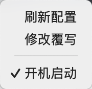
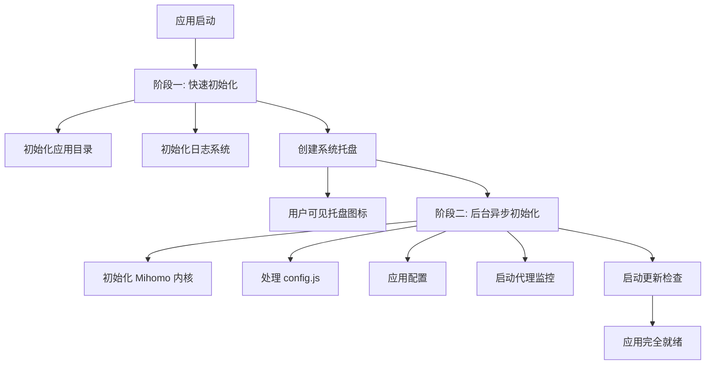

<div align="center">

# Mimi

**基于 Mihomo 内核的轻量级代理桌面应用**

[](https://go.dev/)
[](https://wails.io/)
[](LICENSE)
[](https://github.com/go-burn/mimi/releases)

[功能特性](#-功能特性) · [快速开始](#-快速开始) · [使用指南](#-使用指南) · [开发文档](#-开发文档)

</div>

---

## 📖 简介

Mimi 是一款现代化的桌面代理应用,基于强大的 [Mihomo](https://github.com/MetaCubeX/mihomo) 内核,使用 [Wails v3](https://wails.io/) 框架构建,提供**原生系统托盘体验**与**极速启动**性能。

本项目仅用于本地网络管理与调试。

### ✨ 核心优势

| 特性 | 说明 |
|------|------|
| 🚀 **秒级启动** | 异步初始化架构,托盘图标即时显示 |
| 🎯 **系统集成** | 原生系统代理 + 自动启动 + TUN 模式 |
| 🔄 **智能更新** | GitHub 自动更新,无需手动下载 |
| 🎨 **跨平台** | Windows (amd64/arm64) & macOS (arm64) |
| 🛡️ **透明代理** | TUN 模式系统级流量拦截 |
| ⚙️ **灵活配置** | JavaScript 配置预处理 (config.js) |

---

## ✨ 功能特性

### 核心功能

- **Mihomo 内核集成**
  - 内置配置预处理器 (config.js 支持)
  - 代理组智能选择与延迟测试

- **系统集成**
  - 系统代理一键开启/关闭
  - TUN 模式支持 (需管理员权限)
  - 开机自启动管理
  - 系统托盘常驻

- **配置管理**
  - 支持 JavaScript 配置预处理 (config.js)
  - 配置文件热重载
  - 配置验证与错误提示

### 平台特性

| 功能 | Windows | macOS |
|------|---------|-------|
| 系统代理 | ✅ | ✅ |
| TUN 模式 | ✅ | ✅ |
| 自动启动 | ✅ | ✅ |
| NSIS 安装包 | ✅ | - |
| .app 应用包 | - | ✅ |

---

## 🚀 快速开始

### 📥 下载安装

**[📦 前往 Releases 页面下载最新版本](https://github.com/go-burn/mimi/releases)**

根据您的操作系统选择对应的安装包:

**🪟 Windows**
- `mimi-vX.X.X-windows-amd64-installer.exe` - 安装程序 (推荐,适用于 Intel/AMD 处理器)
- `mimi-vX.X.X-windows-amd64.zip` - 便携版
- `mimi-vX.X.X-windows-arm64.zip` - 便携版

**🍎 macOS**
- `mimi-vX.X.X-darwin-arm64.app.tar.gz` - Apple Silicon (M1/M2/M3/M4)

**安装说明:**
- **Windows**: 下载 `.exe` 文件双击安装,或解压 `.zip` 文件直接运行
- **macOS**: 下载后解压,移动到"应用程序"文件夹,首次打开前运行 `xattr -cr /Applications/mimi.app`

---

## 📖 使用指南

### 快速配置

#### 1️⃣ 准备配置文件

在项目根目录找到 `config.js` 模板文件,修改订阅信息:

```javascript
// config.js
const subscriptions = {
};
```

#### 2️⃣ 应用配置

1. **启动应用** - 系统托盘将显示 Mimi 图标
2. **右键托盘图标** → `修改覆写` → 粘贴修改后的 `config.js` 内容
3. **右键托盘图标** → `刷新配置` → 等待配置加载完成



#### 3️⃣ 启用代理

**系统代理模式 (推荐新手)**:
- 右键托盘图标 → 勾选 `系统代理`
- 所有系统流量将通过代理

**TUN 模式 (需管理员权限)**:
- 右键托盘图标 → 勾选 `TUN 模式`
- 提供更强的流量拦截能力

#### 4️⃣ 选择代理节点

- 右键托盘图标 → `代理组` → 选择你想要的节点

---

### 高级配置

<details>
<summary><b>⚙️ config.js 配置详解</b></summary>

config.js 是一个 JavaScript 预处理器,允许你动态生成 Mihomo 配置:

```javascript
// 自定义代理节点
const customProxies = [
];

// 自定义规则
const customRules = [
    "DOMAIN-SUFFIX,example.com,DIRECT",
    "IP-CIDR,192.168.0.0/16,DIRECT",
];

function main(params) {
    // 在这里自定义配置处理逻辑
    params.proxies.push(...customProxies);
    params.rules.unshift(...customRules);
    return params;
}
```

完整配置示例请参考项目根目录的 `config.js` 文件。

</details>

<details>
<summary><b>🔧 配置文件位置</b></summary>

应用配置文件存储位置:

**Windows**:
```
%APPDATA%/mimi/
├── mihomo/
│   ├── config.yaml      # Mihomo 主配置
│   ├── Country.mmdb     # GeoIP 数据库
│   └── cache.db         # 缓存
└── logs/
    └── mimi.log          # 应用日志
```

**macOS**:
```
~/Library/Application Support/mimi/
├── mihomo/
│   ├── config.yaml
│   ├── Country.mmdb
│   └── cache.db
└── logs/
    └── mimi.log
```

</details>

---

## 👨‍💻 开发文档

### 项目架构

```
mimi/
├── main.go              # 应用入口 - 快速启动流程
├── menu.go              # 托盘菜单逻辑 - 代理组选择、延迟测试
├── mihomo.go            # Mihomo 内核集成 - 配置加载与应用
├── operator.go          # 代理操作接口 - 配置 CRUD
├── privilege.go         # 权限提升 - TUN 模式权限管理
├── proxy_status.go      # 代理状态监控 - 实时连接检测
├── tray.go              # 系统托盘 - 菜单与图标管理
├── version.go           # 版本信息与自更新 - GitHub Release
├── vm.go                # JavaScript 虚拟机 - config.js 执行器
├── window.go            # 窗口管理 - 配置编辑器
├── config/              # 配置路径管理 - 跨平台路径
├── autostart/           # 开机自启动 - 平台特定实现
├── sysproxy/            # 系统代理设置 - Win/macOS 代理
├── update/              # 自动更新逻辑 - go-github-selfupdate
├── frontend/            # 前端资源 (Vite + Vanilla JS)
│   ├── index.html
│   ├── package.json
│   └── public/
└── build/               # 构建配置 - Wails/NSIS/Taskfile
```

### 启动流程

应用采用**两阶段启动**设计,确保快速响应:



### 开发规范

#### 代码风格

```bash
# 格式化代码
go fmt ./...

# 静态检查
go vet ./...

# 运行测试
go test ./...
```

#### 提交规范

遵循 [Conventional Commits](https://www.conventionalcommits.org/):

```
feat: 添加新功能
fix: 修复 Bug
docs: 文档更新
style: 代码格式调整
refactor: 重构
perf: 性能优化
test: 测试相关
chore: 构建/工具链相关
```

#### 分支策略

- `main`: 稳定分支,仅接受 PR 合并
- `feature/*`: 新功能开发
- `fix/*`: Bug 修复
- `docs/*`: 文档更新

---

## 🤝 贡献指南

我们欢迎并感谢任何形式的贡献! 无论是报告 Bug、提出新功能建议,还是提交代码改进。

### 如何贡献

#### 🐛 报告问题

发现 Bug? 请[创建 Issue](https://github.com/go-burn/mimi/issues/new) 并提供:

- **操作系统版本** (Windows 11 22H2, macOS 14.2 等)
- **应用版本** (在托盘菜单 "关于" 中查看)
- **复现步骤** (详细描述如何触发问题)
- **日志文件** (位于 `{AppData}/mimi/logs/app.log`)

#### 💡 功能建议

有好的想法? 欢迎在 [Discussions](https://github.com/go-burn/mimi/discussions) 中分享!

#### 🔧 提交代码

1. **Fork 本仓库**
2. **创建特性分支**
   ```bash
   git checkout -b feature/amazing-feature
   ```
3. **编写代码并测试**
   ```bash
   go fmt ./...
   go vet ./...
   go test ./...
   ```
4. **提交更改** (遵循 [Conventional Commits](https://www.conventionalcommits.org/))
   ```bash
   git commit -m "feat: add amazing feature"
   ```
5. **推送到分支**
   ```bash
   git push origin feature/amazing-feature
   ```
6. **创建 Pull Request**

### Pull Request 检查清单

- [ ] 代码通过 `go fmt` 和 `go vet` 检查
- [ ] 添加了必要的测试
- [ ] 更新了相关文档
- [ ] 提交信息遵循规范
- [ ] 确保跨平台兼容性 (Windows/macOS)

---

## 📄 许可证

本项目采用 **[MIT License](LICENSE)** 开源协议。

```
MIT License

Copyright (c) 2025 Mimi Contributors

Permission is hereby granted, free of charge, to any person obtaining a copy
of this software and associated documentation files...
```

您可以自由地使用、修改和分发本软件,但需保留版权声明。

---

## ❓ 常见问题

<details>
<summary><b>Q: 为什么 macOS 提示"无法验证开发者"?</b></summary>

**A**: 这是 macOS 的安全机制。解决方法:

1. 打开 `系统偏好设置` → `安全性与隐私`
2. 在 "通用" 标签页中点击 "仍要打开"
3. 或使用命令行移除隔离标记:
   ```bash
   xattr -cr /Applications/mimi.app
   ```

</details>

<details>
<summary><b>Q: TUN 模式需要管理员权限吗?</b></summary>

**A**: 是的。TUN 模式需要创建虚拟网卡,需要管理员/root 权限:

- **Windows**: 应用会自动弹出 UAC 提权对话框
- **macOS**: 会弹出系统授权对话框,输入密码即可

</details>

<details>
<summary><b>Q: 如何查看应用日志?</b></summary>

**A**: 日志文件位置:

- **Windows**: `%APPDATA%\mimi\logs\app.log`
- **macOS**: `~/Library/Application Support/mimi/logs/app.log`

也可在命令行启动应用查看实时日志:
```bash
# macOS
/Applications/mimi.app/Contents/MacOS/mimi

# Windows
C:\Program Files\mimi\mimi.exe
```

</details>

<details>
<summary><b>Q: 支持 Linux 吗?</b></summary>

**A**: 目前暂不支持 Linux。如果您愿意贡献 Linux 平台支持,欢迎提交 PR!

</details>

<details>
<summary><b>Q: 如何更新到最新版本?</b></summary>

**A**: 应用内置自动更新功能:

1. 后台每小时自动检查更新
2. 发现新版本时,托盘菜单会显示 "🔄 检查更新 (有新版本)"
3. 点击菜单项确认更新,应用会自动下载并重启

也可手动从 [Releases](https://github.com/go-burn/mimi/releases) 下载最新版本。

</details>

---

## 🙏 致谢

本项目的诞生离不开以下优秀的开源项目:

| 项目 | 说明 |
|------|------|
| [Mihomo](https://github.com/MetaCubeX/mihomo) | 强大的代理内核,支持多种协议 |
| [Wails](https://wails.io/) | 使用 Go 构建桌面应用的现代框架 |
| [goja](https://github.com/dop251/goja) | Pure Go JavaScript 引擎 |

感谢所有贡献者和用户的支持! ❤️

---

## 📞 联系与支持

- **问题反馈**: [GitHub Issues](https://github.com/go-burn/mimi/issues)
- **功能讨论**: [GitHub Discussions](https://github.com/go-burn/mimi/discussions)
- **开发文档**: 查看上方 [开发文档](#-开发文档) 章节

---

<div align="center">

### Star History

[](https://star-history.com/#go-burn/mimi&Date)

---

**[⬆ 回到顶部](#mimi)**

Made with ❤️ using [Wails](https://wails.io/) and [Mihomo](https://github.com/MetaCubeX/mihomo)

**如果这个项目对你有帮助,请给一个 ⭐ Star!**

</div>
